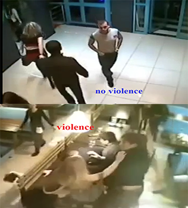
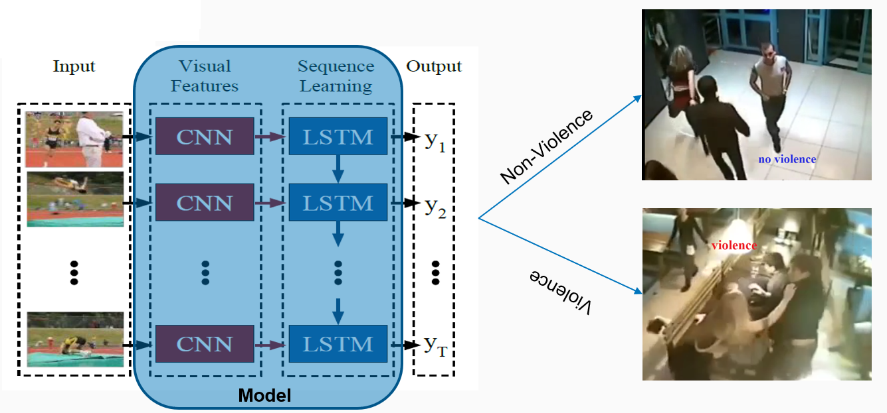
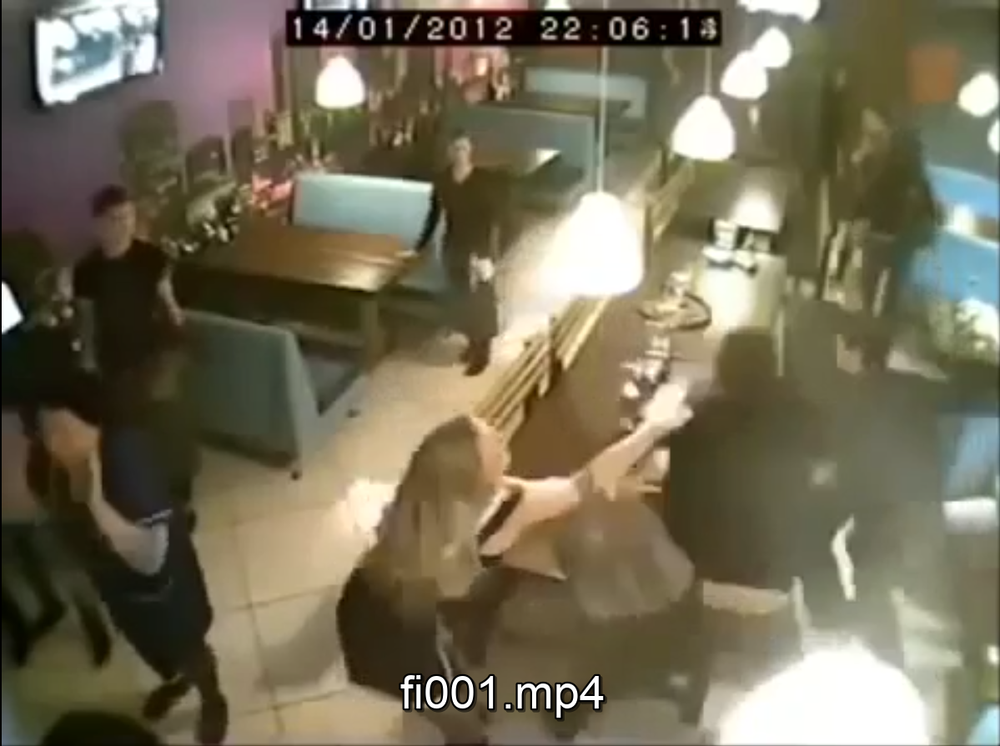

# NHẬN DẠNG HÀNH ĐỘNG BẠO LỰC QUA VIDEO 
GROUP N009: [Pham Duc Duy](duypd.13@grad.uit.edu.vn ) - [Dong Dang Khoa](khoadd.14@grad.uit.edu.vn) - [Vo Dinh Nha](nhavd.14@grad.uit.edu.vn)

## License [](https://github.com/Naereen/StrapDown.js/blob/master/LICENSE)


## Violence Detection [](https://www.python.org/) [](https://colab.research.google.com)
Là mục tiêu đề tài mà nhóm đã thảo luận và đưa ra ý kiến thống nhất

Để thực hiện và hoàn thành project, nhóm N009 đã lựa chọn phương pháp nhận diện hành động bạo lực bằng việc kết hợp giữa Convolution Neural Networks và Long Short Term Memory.

- [Violence_detection.ipynb](https://github.com/nhavd/CS2225.CH1501/blob/master/Violence%20Detection/Violence_detection.ipynb): Cài đặt mô hình
- [ViolenceDetection_RootDataset.h5](https://drive.google.com/drive/folders/1af1PtjjSYbQG8keQ--QoTEAWpzerzFt_?usp=sharing): Model file
- [Predictor.ipynb](https://github.com/nhavd/CS2225.CH1501/blob/master/Violence%20Detection/Predictor.ipynb): Kiểm thử mô hình trên tập dữ liệu mới 

## Kết quả nhận diện mong muốn từ giải pháp


## Project timeline

**`07-09-2020`**: Thảo luận ý tưởng, tìm kiếm các đề tài mong muốn liên quan đến môn học.

**`15-09-2020`**: Thống nhất ý tưởng, viết mô tả đề tài

**`10-10-2020`**: Thảo luận nhóm về đề tài, tìm kiếm, tổng hợp các tài liệu tham khảo

**`30-11-2020`**: Nhóm học tập hoàn thành việc tìm hiểu các kiến thức cơ bản liên quan đề tài, chạy thử nghiệm 1 số demo

**`13-12-2020`**: Họp nhóm, xây dựng các phiên bản mã nguồn 

**`27-12-2020`**: Merge mã nguồn

**`10-01-2021`**: Họp nhóm, Viết báo cáo, chuẩn bị các resource cần thiết 

**`31-01-2021`**: Họp nhóm, thống nhất chỉnh sửa mã nguồn, báo cáo. 

**`06-02-2021`**: Hoàn tất bài báo cáo, chuẩn bị submit

## Nội dung trình bày
*********************************************************************************************
*[1. Mô tả bài toán](#mô-tả-bài-toán)*

*- [Giới thiệu](#giới-thiệu)*

*- [Phân loại bài toán](#phân-loại-bài-toán)*

*[2. Phương pháp giải quyết bài toán](#phương-pháp-giải-quyết-bài-toán)*

*[3. Vấn đề về dữ liệu](#vấn-đề-về-dữ-liệu)*

*[4. Thực thi](#thực-thi)*

*[5. Kết quả](#kết-quả)*

*[6. Đánh giá](#đánh-giá)*

*[7. Datasets](#datasets)*
*********************************************************************************************

## Mô tả bài toán

### Giới thiệu

Ngày nay, bạo lực xảy ra khắp nơi với rất nhiều lý do xã hội. Ứng dụng công nghệ góp phần hạn chế bạo lực xảy ra bằng việc sử dụng các camera an ninh, giám sát 24/7 tại các địa điểm nóng. Cùng với đó, 1 lượng lớn videos được tạo ra mỗi giây, đòi hỏi các giám sát viên liên lục theo dõi trên màn hình, như vậy không hiệu quả. Để giải quyết 1 trong các bài toán tương tự, Deep learning ra đời, nó có thể tự động phát hiện các bất thường một cách nhanh chóng. Ta có thể ứng dụng để trích xuất các đoạn video bất thường (ở đề tài này là các đoạn video có chứa hành vi bạo lực), đưa qua các thuật toán để đánh giá chính xác hơn, kết quả nhận được là cảnh báo video có chứa hành động bạo lực hay không.

Cụ thể trong đồ án này, ta có input là một đoạn video, khi đi qua bộ nhận dạng ta sẽ nhận được kết quả đánh giá về video, có hay không bạo lực.

- <b>Input</b>: Đoạn video

- <b>Output</b>:Nhãn thông báo video có chứa hành động bạo lực hay không

- <b>Hướng tiếp cận</b>: Phương pháp giải bài toán chỉ giới hạn ở việc nhận diện hành động bạo lực. Trong đó khi ảnh/video được upload lên thì các khung hình sẽ được trích xuất, đồng thời thuật toán trong mô hình huấn luyện sẽ quét qua tất cả các hình này và nhận diện xem có hành động bạo lực hay không?

- <b>Giới hạn</b>: Số lượng đối tượng trong 1 khung ảnh < 10, ít chồng lấn. Tập dữ liệu huấn luyện còn hạn chế về số lượng.

- <b>Minh họa</b>



### Phân loại bài toán

Bài toán này, ta phải nhận hạng được hành động bạo lực, thông qua kỹ thuật trích xuất đặc trưng và phát hiện hành động bạo lực đó. Có thể nói, đây thuộc loại bài toán về <b>Object detection</b>. Bằng mô hình đã training, chúng ta có thể phân loại đâu là video có chứa hành động bạo lực, đâu là video không chứa hành động bạo lực. Dựa trên các video chứa hành động bạo lực có thể detect được vị trí của hành động bạo lực trong video.
<p align="center">
  
</p>

## Phương pháp giải quyết bài toán

Sử dụng mô hình Deep Learning – Convolutional Neural Network (CNN) kết hợp phương pháp Long Short Term Memory (LSTM). Một mạng CNN đưa các input video (frame) và các output đặc trưng vào LSTM để học các đặc trưng global temporal, sau đó phân loại các đặc trưng bằng các mạng kết nối đầy đủ (fully connected layer). Network này không chỉ implement được bởi các pre-trained mode trong ImageNet database, mà nó rất linh hoạt để thực hiện trên các video có thời lượng bất định, và độ chính xác có thể lên đến 98,5% mặc dù xử lý hình ảnh theo thời gian thực.

Đồ án kết hợp giữa convloutional neural networks (Transfer learning) và long short term memory để  phân loại video thành hai loại chính 
* 0: No Violence 
* 1: Violence


<i>Mô hình CNN-LSTM với ý tưởng mô hình là trích xuất tập hợp các frames của video, đưa vào mảng đã pre-train là VGG. Đầu ra của lớp này sẽ là input của lớp tiếp theo, được đào tạo bởi kiến trúc mạng khác với mạng Neuron Network là LSTM. Trong quá trình phân tích, nếu có frame chứa hành động bạo lực, mô hình sẽ cho ra output như mong muốn.</i>

## Vấn đề về dữ liệu

<b>Tổng số mẫu</b>: 1201 videos + 30 videos
* Training: 951 videos (475 violence, 476 non violence)
* Testing: 250 videos (125 violence, 125 non violence)
* Validation: 30 other sources videos (10 violence, 20 non violence)

<b>Cách thu thập</b>
* Nguồn dữ liệu có sẵn [7. Datasets](#datasets)
* Số loại nhãn: 2 (none_violence và violence)

Dữ liệu chưa đủ lớn để tăng mức độ đánh giá độ chính xác của thuật toán. Sẽ tìm kiếm và test thêm với bộ dữ liệu video có tính chất phức tạp (về khả năng có bạo lực hay không)

## Thực thi

Liên kết bộ dữ liệu Google Drive 

```python
from google.colab import drive
drive.mount('/content/drive/')
```
Import một số thư viện chính (CNN, LSTM)

```python
import tensorflow
from tensorflow.keras.utils import to_categorical
from tensorflow.keras.applications import VGG19,ResNet50
from tensorflow.keras.layers import LSTM , Dense , TimeDistributed, Flatten, Dropout, GlobalAveragePooling2D, GlobalAveragePooling1D, Input
from tensorflow.keras.layers import Reshape, BatchNormalization ,ConvLSTM2D
from tensorflow.keras.models import Sequential
from tensorflow.keras.optimizers import Adam , RMSprop, SGD
```
Sử dụng cấu trúc dữ liệu của Pandas là DataFrame, gán nhãn cho video

```python
dtframe = pd.DataFrame()
...
dtframe['video_name'] = vid
dtframe['tag'] = lab
dtframe.head
```

Phân chia video cho các Dataset tương ứng 

```python
traindf = dtframe[:100]
...
valdf = dtframe[101:151]
...
```

Các method Xử lý hậu kỳ

```python
def autocrop(image, threshold=0):
...
def scale_and_resize(image):
...
```
Trích xuất Frame từ video

```python
def extract_frames(videodf, start_index = 0, end_index =-1)
...
```
Áp dụng mô hình

```python
def CNN_LSTM(model_arch, opt, retrain ,init_weights = 'imagenet'):
```
Truyền các parameter tương ứng và fit mô hình

```python
vgg_adam_retrain = CNN_LSTM('Vgg19', 'Adam', True)
vgg_adam_retrain_history = vgg_adam_retrain.fit(fvideo,flabels, batch_size=10, epochs=20, validation_data=(tvideo , tlabels))
```
Xuất MAP ra màn hình

```python
plot_results(vgg_adam_static_history)
```
Save Model

```python
diff_vgg_rmsprop_retrain.save("./drive/MyDrive/Colab Notebooks/model/ViolenceDetection_RootDataset.h5")
```

## Kết quả

Load Model để sử dụng với bộ Testing

```python
ViolenceDetection = load_model('ViolenceDetection_RootDataset.h5')
```
Xây dựng Method load video và xử lý với Mô hình đã train, phục vụ testing
```python
def Violence_detection(videoname):
  vid, img = extract_frames(videoname)

  violence_res = ViolenceDetection(vid)
  if violence_res > 0.6:
    print("Violence Detected")
  else:
    print("No Violence Detected")
```
Kết quả

```python

Violence_detection('fi001.mp4') #Violence Detected
```


## Đánh giá

Sử dụng lần lượt các mạng CNN và optimization method với nhau. Kết quả thực thi được đánh giá thông qua các biểu đồ

<p align="center">
  
    
    
    
</p>

Để cải thiện độ chính xác, cần training với bộ dữ liệu lớn, đặc thù trong lĩnh vực đang quan tâm như trường học, nhà xưởng,...

## Datasets:

* [Hockey Fight Dataset](https://academictorrents.com/details/38d9ed996a5a75a039b84cf8a137be794e7cee89)

* [Movies Fight Dataset](https://academictorrents.com/details/70e0794e2292fc051a13f05ea6f5b6c16f3d3635)

* [Surveillance Cameras](https://github.com/sayibet/fight-detection-surv-dataset)
