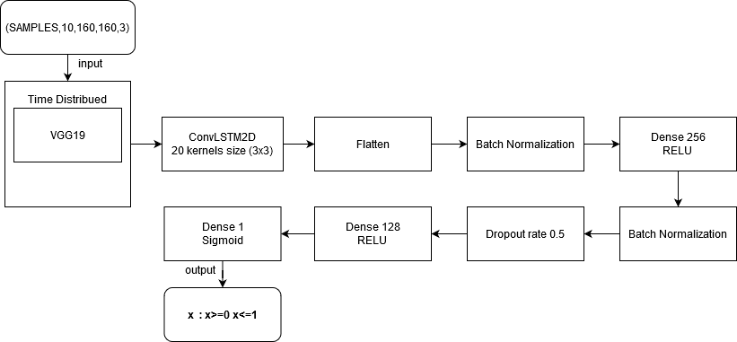

# Nhận dạng hành vi bạo lực sử dụng CNN-LSTM

Đồ án kết hợp giữa convloutional neural networks (Transfer learning) và long short term memory để  phân loại video thành hai loại chính 
0: No Violence 
1: Violence

Kiến trúc cụ thể

Datasets của đồ án tham khảo tại:

Hockey Fight Dataset: https://academictorrents.com/details/38d9ed996a5a75a039b84cf8a137be794e7cee89

Movies Fight Dataset: https://academictorrents.com/details/70e0794e2292fc051a13f05ea6f5b6c16f3d3635
